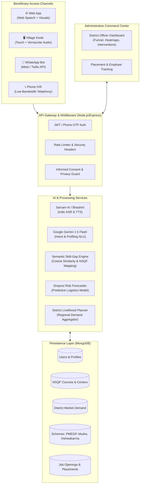

# 🌾 AI Voice Assistant for Livelihood Mapping and Skilling
### Smart India Hackathon (SIH 2024) | Problem Statement: SIH26097
**Ministry:** Ministry of Social Justice and Empowerment (MoSJE)  
**Scheme:** Pradhan Mantri Anusuchit Jaati Abhyuday Yojana (**PM-AJAY**) — Grants-in-Aid (GIA) Component

---

## 📌 Executive Summary

Rural and low-literacy youth, particularly from Scheduled Caste (SC) and marginalized communities, face severe systemic barriers to livelihood discovery:
- **Digital & Literacy Barriers:** Form-heavy, complex English/Hindi portals exclude rural vernacular speakers.
- **Information Asymmetry:** Beneficiaries are unaware of high-demand local trades, NSQF certifications, or central capital subsidies.
- **High Training Dropouts:** 30–45% of candidates drop out of vocational courses due to commute challenges, financial distress, and misaligned expectations.

**Our Solution:** A **multilingual, empathetic conversational AI assistant** that conducts low-stress vernacular voice interviews, maps existing informal capabilities against **NSQF (National Skills Qualifications Framework)** competencies, formulates personalized learning pathways linked to local district demand, and provides district administration with real-time dropout early-warning telemetry and placement tracking.

---

## 🏛️ System Architecture



---

## 🚀 Key Modules & Capabilities

### 1. 🎙️ Empathetic Multilingual Voice Interviewer
- **Indic Voice-First Interaction:** Fluent in **Telugu, Hindi, and English** with context-aware dialect tolerance.
- **Informal Skill Extraction:** Identifies hidden vocational competencies (e.g., tailoring, tractor repair, dairy, masonry) from unstructured conversational speech without technical jargon.
- **Zero-Caste Architecture:** Adheres strictly to the Digital Personal Data Protection (DPDP) Act. No caste identifiers are stored; eligibility is evaluated purely through verified program parameters.

### 2. 🎯 NSQF Skill-Gap Diagnostic & Pathways
- Matches informal skills against standard **National Occupational Standards (NOS)** and NSQF levels (Levels 3–6).
- Highlights exact missing competencies and maps them directly to nearby **PMKVY** and **PM-AJAY** accredited training centers.
- Generates phased, actionable career roadmaps complete with timelines, course providers, and expected monthly wage increments.

### 3. 🔮 "What-If" Simulation Studio
- An interactive career planning simulator allowing beneficiaries to explore the question: *"What happens to my job matches and monthly income if I acquire a new skill?"*
- Calculates instant ROI on learning investments (e.g., adding *Solar Inverter Troubleshooting* to *Basic Electrical* creates a ₹7,500/month average wage jump).

### 4. 💼 Self-Employment & Capital Subsidies Finder
- Tailored for candidates preferring micro-entrepreneurship over wage employment.
- Automatically pairs target trades with active government schemes:
  - **PM Vishwakarma:** Toolkit incentives & collateral-free loans up to ₹3 Lakhs.
  - **PMEGP:** 25–35% capital subsidy for rural micro-enterprises.
  - **PM MUDRA (Shishu / Kishor):** Working capital funding.
- Provides actionable checklists, required equipment lists, and district nodal contact details.

### 5. 🛡️ Dropout Early Warning System (EWS)
- Machine learning risk evaluation measuring:
  - Attendance trends & consecutive days absent
  - Commute distance & public transit availability
  - Stipend disbursement delays
  - Assessment milestones
- Automatically flags high-risk trainees on the **Training Center Dashboard**, enabling proactive counselor home visits or travel stipends before dropout occurs.

### 6. 📊 District Officer Command Center
- **5-Stage Conversion Funnel:** Mobilized ➔ Enrolled ➔ Trained ➔ Certified ➔ Placed.
- **Regional Demand Heatmaps:** Highlights local sector gaps (e.g., high apparel demand in Warangal vs. agro-processing demand in Adilabad).
- **Automated District Action Plans:** Generates downloadable resource allocation proposals aligned with PM-AJAY GIA district allocations.

---

## 🛠️ Technology Stack

| Layer | Technologies |
| :--- | :--- |
| **Frontend** | React 18, Vite, React Router v6, Lucide Icons, Vanilla CSS Design System |
| **Backend API** | Node.js (ESM), Express.js, Mongoose ODM |
| **Database** | MongoDB 6+ |
| **Generative AI & NLU** | Google Gemini 1.5 Flash (`@google/generative-ai`), Regex-based Robust Offline Fallbacks |
| **Indic Speech & Audio** | Sarvam AI API, Web Speech Recognition & SpeechSynthesis APIs |
| **Telephony & Messaging** | Twilio Messaging API (WhatsApp Sandbox), Twilio Voice (TwiML IVR) |
| **Security & Privacy** | JWT Auth, Bcrypt, Helmet, Express Rate Limiting, Strict Consent Audits |

---

## 📂 Project Structure

```
├── client/                     # Frontend Application (React + Vite)
│   ├── public/                 # Static assets, branding logos, manifest
│   ├── src/
│   │   ├── assets/             # Visual media & banner graphics
│   │   ├── context/            # Global state (AuthContext, ToastContext)
│   │   ├── i18n/               # Localization bundles (en.js, te.js, hi.js)
│   │   ├── layouts/            # Page layouts & responsive sidebars
│   │   ├── pages/              # Beneficiary pages (Assistant, Dashboard, What-If, etc.)
│   │   │   └── admin/          # Officer pages (Overview, Placements, Directory, etc.)
│   │   ├── api.js              # Centralized Axios/Fetch API client
│   │   ├── App.jsx             # Route definitions and navigation guards
│   │   └── styles.css          # Theme design tokens, glassmorphism, responsive grid
│   └── package.json
│
├── server/                     # Backend Application (Node.js + Express)
│   ├── src/
│   │   ├── channels/           # Multi-channel handlers (IVR, WhatsApp, Speech)
│   │   ├── middleware/         # Auth, Role Verification, Rate Limiting
│   │   ├── models/             # Mongoose schemas (User, Profile, Course, Scheme, etc.)
│   │   ├── routes/             # REST endpoints (auth, assistant, pathway, jobs, etc.)
│   │   ├── seed/               # Data catalogs (occupations, courses, schemes, demo seed)
│   │   ├── services/           # Matching, LLM, Dropout, Embeddings, Planning
│   │   └── index.js            # Express server initialization
│   └── package.json
│
└── docs/                       # Architecture, Policy, and Presentation Specs
    ├── ARCHITECTURE.md
    ├── DEMO_VIDEO_SCRIPT.md
    ├── IMPACT_AND_METRICS.md
    └── RESPONSIBLE_AI_PRIVACY.md
```

---

## ⚡ Quick Start & Setup Guide

### Prerequisites
- [Node.js](https://nodejs.org/) v18.0.0 or higher
- [MongoDB Community Server](https://www.mongodb.com/try/download/community) running locally on port `27017` (or MongoDB Atlas URI)
- Git

---

### Step 1: Clone the Repository
```bash
git clone https://github.com/goutham-120/smart-livelihood.git
cd smart-livelihood/1234
```

---

### Step 2: Configure Backend Environment Variables
Create a file named `.env` inside the `server/` directory:

```env
# Server Configuration
PORT=5000
NODE_ENV=development
PUBLIC_BASE_URL=http://localhost:5000
CORS_ORIGIN=http://localhost:5173,http://localhost:3000

# Database
MONGO_URI=mongodb://127.0.0.1:27017/livelihood

# Authentication
JWT_SECRET=super_secret_pmajay_production_key_2024
ALLOW_DEMO=true

# AI & Speech Services
LLM_API_KEY=your_google_gemini_api_key
SARVAM_API_KEY=your_sarvam_ai_api_key
SPEECH_PROVIDER=sarvam

# Telephony (Optional for WhatsApp / IVR Live Testing)
TWILIO_ACCOUNT_SID=your_twilio_account_sid
TWILIO_AUTH_TOKEN=your_twilio_auth_token
TWILIO_WHATSAPP_FROM=whatsapp:+14155238886
```

---

### Step 3: Install Dependencies & Seed Database

#### Backend Setup:
```bash
cd server
npm install
# Seed NSQF courses, occupations, regional demand, schemes, and demo personas
npm run seed:demo
```

#### Frontend Setup:
```bash
cd ../client
npm install
```

---

### Step 4: Run the Development Servers

Open two terminal windows:

#### Terminal 1 — Backend:
```bash
cd server
npm run dev
# Server will start on http://localhost:5000
```

#### Terminal 2 — Frontend:
```bash
cd client
npm run dev
# Client will start on http://localhost:5173
```

Now open **`http://localhost:5173`** in your browser.

---

## 👥 Pre-Seeded Demo Personas

The database seed provides ready-to-test personas across all user roles:

| Role | Username / Email | Password | Context / Persona Focus |
| :--- | :--- | :--- | :--- |
| **Beneficiary (Tailoring)** | `beneficiary@demo.gov.in`<br>*(or Phone: `9876543210` / OTP: `123456`)* | `Demo@123` | Rural beneficiary seeking formal apparel certification & MUDRA loan |
| **Beneficiary (Solar)** | `ramesh@demo.gov.in` | `Demo@123` | Informal electrician looking to upskill in Solar PV installation |
| **District Officer** | `officer.warangal@demo.gov.in` | `Officer@123` | Warangal District Officer tracking skilling funnels & regional demand |
| **Training Center** | `center.rajesh@demo.gov.in` | `Center@123` | Center manager monitoring student attendance & dropout risks |
| **State Admin** | `admin@demo.gov.in` | `Admin@123` | State-level administrator with comprehensive policy & placement access |

*(All accounts can be one-click selected using the **Demo Accounts** panel on the login screen).*

---

## 🌐 Omni-Channel Verification & Testing

| Channel | Access Method | How to Test |
| :--- | :--- | :--- |
| **Web Portal** | Browser at `http://localhost:5173` | Login ➔ Click Voice Assistant ➔ Speak in Telugu, Hindi, or English. |
| **Kiosk Mode** | `http://localhost:5173/kiosk` | Large-touch vernacular interface with auto-timeout and high-contrast audio guidance. |
| **WhatsApp Bot** | `POST /api/channels/whatsapp/webhook` | Simulates inbound WhatsApp chat with intent matching, course lookups, and scheme info. |
| **IVR Telephony** | `POST /api/channels/ivr/incoming` | Returns TwiML audio prompts with DTMF trade selection (1=Tailor, 2=Dairy, 3=Solar). |
| **Channel Sandbox**| `http://localhost:5173/channels` | Interactive UI simulator for testing WhatsApp and IVR call flows side-by-side. |

---

## 🔌 Core API Endpoints

### 🔐 Authentication & Profile
- `POST /api/auth/register` — Register new beneficiary with OTP / Password.
- `POST /api/auth/login` — Authenticate and receive JWT token.
- `GET /api/profile/me` — Retrieve verified user qualifications, target trades, and consent status.
- `PUT /api/profile/skills` — Update beneficiary formal & informal skills.

### 🤖 Voice & Conversational AI
- `POST /api/assistant/chat` — Conversational dialogue turns with entity extraction.
- `POST /api/assistant/speech-to-text` — Audio buffer transcription (Sarvam/Bhashini).
- `POST /api/assistant/text-to-speech` — Generates vernacular audio response stream.

### 🎯 Skilling, Pathways & Simulator
- `GET /api/opportunities` — Evaluates user skills against regional demand and courses.
- `GET /api/pathway/:occupationKey` — Generates milestone roadmap and course recommendations.
- `POST /api/pathway/what-if` — Simulates career outcome and wage improvements.
- `GET /api/self-employment/:occupationKey` — Fetches relevant capital schemes and equipment grants.

### 📈 Administration & Analytics
- `GET /api/analytics/overview` — District-level conversion funnel and placement KPIs.
- `GET /api/analytics/dropout-risk` — Early warning candidate list flagged by predictive model.
- `POST /api/plans/generate` — Automated annual livelihood action plan for district collectors.

---

## 🔒 Responsible AI & Data Ethics
- **DPDP Act (India) Compliance:** Explicit digital consent is captured prior to voice recording. Beneficiaries retain the right to export all profile data or trigger instant account erasure (`DELETE /api/privacy/delete-account`).
- **Explainable Recommendations:** Every suggested course or occupation clearly details the rationale: *"Recommended because your Sewing skill matches 85% of this course and Warangal has 40 active apparel job vacancies."*
- **Audit Logging:** Every administrative action and profile modification is recorded in an immutable audit ledger (`AuditLog`).

---

## 📄 License & Attribution

Developed for the **Smart India Hackathon (SIH 2024)** under problem statement **SIH26097**.  
Aligned with the guidelines of the **Ministry of Social Justice and Empowerment, Government of India**.
