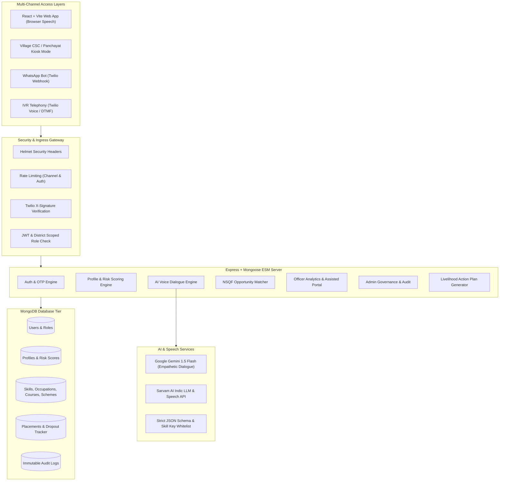
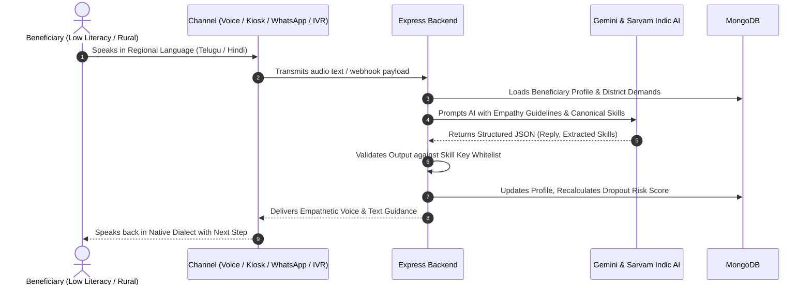

# System Architecture & Technical Specification
## Project: SIH26097 - AI Voice Assistant for Livelihood Mapping and Skilling (PM-AJAY, GIA Component)

### 1. High-Level Architecture Diagram

### 2. Multi-Channel Dialogue Flow

### 3. Core Security and Privacy Boundaries
1. **Zero-Caste Storage Guarantee**: Caste is never requested, collected, stored, or processed.
2. **District Scoping**: District Livelihood Officers can only view and manage records within their designated district.
3. **Strict AI Guardrails**: All generative outputs are validated against strict JSON schemas and validated skill master keys.
4. **Audit Immutability**: All read/export/delete actions on beneficiary data generate audit log entries.
